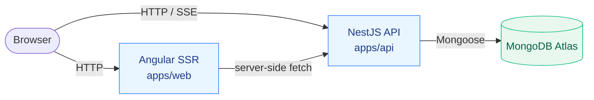

# Restaurant Platform

[](https://github.com/ksendart/restaurant-platform/actions/workflows/ci.yml)

A full-stack pet project: a small restaurant chain's public site (menu, cart, takeaway orders) plus an internal admin dashboard with a real-time order board and basic analytics. Built as a portfolio piece around **Angular 20** (signals, zoneless, SSR with Incremental Hydration) on the front and **NestJS + MongoDB** on the back, organized as an Nx monorepo.

## Live demo

- **Customer site** — https://restaurant-platform-web-47vd.onrender.com
- **API** — https://restaurant-platform-api-ytrh.onrender.com

> Hosted on Render's free tier. The first request after a period of inactivity may take ~30–60 seconds while the service cold-starts. MongoDB Atlas M0 (free shared cluster) is used for persistence.

### Test accounts

The API seeds a fixed set of accounts on bootstrap (controlled via `SEED_ENABLED`):

| Role     | Email                            | Password                            |
| -------- | -------------------------------- | ----------------------------------- |
| Customer | `customer1@local.test`           | `Customer12345!`                    |
| Customer | `customer2@local.test`           | `Customer12345!`                    |
| Customer | `customer3@local.test`           | `Customer12345!`                    |
| Admin    | configured via `ADMIN_EMAIL` env | configured via `ADMIN_PASSWORD` env |

## Features

- Public menu rendered server-side (SSR + Incremental Hydration).
- Customer flow: register → add to cart → checkout (mock payment) → see live order status updates.
- Admin dashboard: order board updated in real time, menu CRUD, basic revenue/top-dishes analytics.
- Real-time updates over **Server-Sent Events** with separate JWT strategies for HTTP (Bearer) and SSE (httpOnly cookie).
- JWT access + refresh tokens; refresh stored as httpOnly cookie with `SameSite=None` for cross-site production.
- i18n-ready (currently English UI), Angular Material with custom SCSS tokens.

## Architecture



Two Render web services (Docker) plus a MongoDB Atlas M0 cluster. The Angular SSR server (`apps/web`) renders the public surface for SEO and hydrates the admin SPA lazily. The NestJS API (`apps/api`) exposes REST endpoints and SSE streams; in-memory `EventEmitter2` fans out order-status events to subscribers, which is fine for a single-instance deploy.

For a deeper write-up — routing, state management, module boundaries, Mongo schema — see [`docs/ARCHITECTURE.md`](./docs/ARCHITECTURE.md). The product scope and non-goals live in [`docs/PROJECT-VISION.md`](./docs/PROJECT-VISION.md).

## Tech stack

| Layer     | Choice                                                               |
| --------- | -------------------------------------------------------------------- |
| Monorepo  | Nx 21                                                                |
| Frontend  | Angular 20 standalone, signals, zoneless, SSR, Incremental Hydration |
| State     | `@ngrx/signals` Signal Store + plain signals                         |
| UI        | Angular Material + custom SCSS tokens                                |
| Real-time | Server-Sent Events (native `EventSource`)                            |
| Backend   | NestJS 11                                                            |
| Database  | MongoDB 7 + Mongoose                                                 |
| Auth      | JWT access (Bearer) + refresh (httpOnly cookie)                      |
| Tests     | Jest (unit) + Playwright (e2e smoke)                                 |
| Hosting   | Render (web services, Docker) + MongoDB Atlas M0                     |
| CI        | GitHub Actions (lint + test + build on `nx affected`)                |

## Repository layout

```
apps/
  api/          NestJS API
  api-e2e/      API e2e tests
  web/          Angular SSR app (public + admin surfaces)
  web-e2e/      Playwright e2e tests
libs/
  ui/                       Angular UI primitives
  feature-*/                Lazy feature modules (menu, admin, auth, account, checkout, shell)
  data-access-orders/       HTTP services for orders
  data-access-sse/          SSE client wrapper
  state/  state-features/   Signal Stores and reusable store features
  analytics/  auth/  menu/  Backend feature modules
  shared-types/             Types shared between web and api
  config/                   API_BASE_URL DI token + environments
docs/                       Architecture, vision, roadmap, feature map
.github/workflows/ci.yml    Lint + test + build on every PR
render.yaml                 Render Blueprint for the two services
```

## Local development

### Prerequisites

- Node.js **20** (matches Render Dockerfiles)
- npm 10
- Docker (optional, for the bundled local Mongo)

### Install

```sh
npm ci --legacy-peer-deps
```

The `--legacy-peer-deps` flag is required because of a peer-dep conflict between `prettier@2` and `@nestjs/schematics@11`. Removing it is tracked as a follow-up.

### Start MongoDB

A `docker-compose.yml` exposes Mongo on `localhost:27017`:

```sh
docker compose up -d
```

Or use your own Mongo / Atlas instance and adjust `MONGO_URI` accordingly.

### Configure environment

Copy the example file and edit values as needed:

```sh
cp .env.example .env
```

Defaults are suitable for local development (admin seeded as `admin@local.test` / `Admin12345!`).

### Run the apps

```sh
# In one terminal — API on http://localhost:3000
npx nx serve api

# In another — Angular SSR on http://localhost:4200
npx nx serve web
```

On first start the API seeds an admin account, three customer accounts, sample dishes, and a few completed orders so the analytics dashboard isn't empty.

### Useful Nx targets

```sh
npx nx run-many --target=lint
npx nx run-many --target=test --configuration=ci
npx nx run-many --target=build
npx nx graph                    # visualize project dependencies
```

CI runs the same targets in `nx affected` mode — see `.github/workflows/ci.yml`.

## Notable design decisions

These are the calls that took some thought; the rationale is here so a reviewer doesn't have to dig through commits.

- **SSE over WebSocket for order updates.** The flow is strictly server → client (status changes), so a one-way primitive fits. SSE works over plain HTTP, reconnects automatically, and passes through Render's proxy unchanged — no extra protocol upgrade dance, no separate gateway. A two-way scenario (e.g. waiter pinging a guest) is planned as a follow-up and would justify adding WS at that point.

- **Two JWT strategies on the API.** The browser cannot set the `Authorization` header on `EventSource`, so SSE auth has to ride on cookies. The API exposes a Bearer strategy for regular HTTP endpoints and a separate `JwtSseStrategy` reading an `rp_access` httpOnly cookie for the `/stream` endpoints. This keeps the rest of the API stateless and avoids passing tokens in query strings.

- **httpOnly cookies + cross-site CORS.** Front and API live on different Render subdomains, so refresh cookies must be `SameSite=None; Secure`, CORS must allow credentials, and every fetch (including `EventSource`) must opt into `withCredentials`. Missing any one of those four switches breaks login silently and was a notable source of friction during the deploy iteration.

- **Refresh token hashing via SHA-256, not bcrypt.** bcrypt silently truncates inputs longer than 72 bytes, and JWT refresh tokens easily exceed that. The API stores `sha256(refreshToken)` and compares via `crypto.timingSafeEqual`. bcrypt is still used where it belongs — user passwords.

- **One Angular app, two surfaces.** Public and admin live in the same `apps/web` project but in separate route trees, with admin loaded lazily under `canMatch(adminGuard)`. `canMatch` (vs `canActivate`) prevents the admin chunk from being downloaded for guests at all.

- **Single Signal Store per domain.** Cart, Auth, Menu, Orders each get one `signalStore`. No classical NgRx (actions/reducers/effects) — overkill for this scope, but Signal Store still gives Redux DevTools, `withEntities`, and a `rxMethod` bridge for the SSE stream.

- **Render free tier, accepting the trade-offs.** Two free Docker web services + Atlas M0 means cold starts after inactivity (~30–60s), no horizontal scaling, and a (theoretical) risk that Cloudflare in front of Render could buffer SSE chunks. The risk was acknowledged up front and verified empirically — order-status updates round-trip in under a second on the deployed instance.

- **Idempotent seeders, opt-in via env.** Seeders only insert when a record is absent (lookup by email / unique field), so they can run safely on every cold start. They are gated on `SEED_ENABLED` so production runs that aren't supposed to mutate data stay clean.

## Roadmap

Iterations 0–6 (bootstrap, public menu with SSR, cart + auth, customer orders with SSE, admin orders, admin menu, analytics) are merged. The current state is **Iteration 8 — Deploy**, now live on Render with CI in place.

**Iteration 7 (SHOULD-features)** — reorder, table bookings, order cancellation, rate limiting, sitemap, a11y polish — was intentionally skipped to ship a deployable demo first. Having a live URL for the portfolio was judged more valuable than another round of features that wouldn't be visible without a deploy. Iteration 7 will be picked up after the post-deploy work.

Next up:

- Iteration 7 — reorder / bookings / cancellation / rate limiting / a11y polish.
- Iteration 9–10 — NICE-features and a WebSocket gateway for two-way scenarios (e.g. waiter pinging a guest).

See [`docs/ROADMAP.md`](./docs/ROADMAP.md) for the full list and [`docs/FEATURE-MAP.md`](./docs/FEATURE-MAP.md) for what's MUST/SHOULD/COULD.

## License

MIT.
